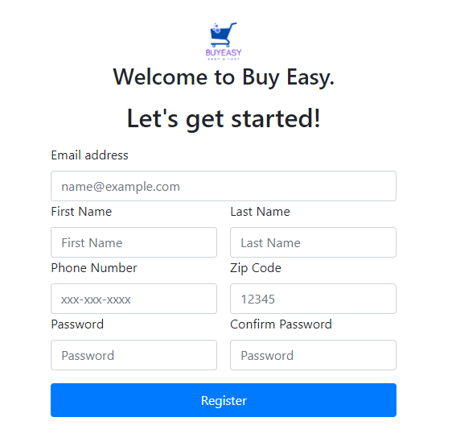

# **OverView**
BuyEasy is an online shopping app that provides a user-friendly platform for easy, fast, and secure shopping experiences. With a comprehensive product catalog and intuitive interfaces, user can easily browse, select,  purchase items and enjoy online shopping.

## **Key features for this version**
1- User Registration and Authentication
- Secure user accounts  with registration and login functionality. Edit profile.

2- Product Management
- Well organized display of products with search options. Comprehensive product pages with some details.
3- Order Management
- Order history for users.

4- Shopping Cart
- USer friendly cart for adding, updating and removing items befor checkout.

## **Entity Diagram**

## **Technology Stack**
- Intellij / Eclipse
- Java / Maven
- Spring Boot
- HTML5 / CSS3
- JavaScript
- MySql
- Git / Github
- Source Tree

## **Example of Outputs**

1- Sign Up Page

2- Login Page

3- Home Page

4- Shopping Cart Page

